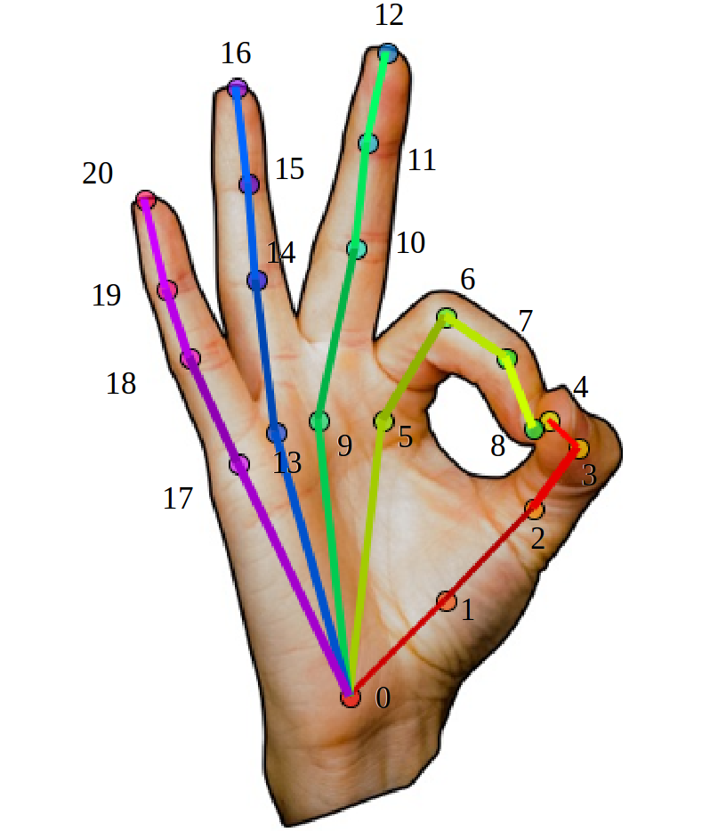

### Data folder structure
```bash
HOGraspNet_DIR/ # ROOT

HOGraspNet_DIR/data/ # data dir
    zipped/ # downloaded zip files
    source_data/ # source data folder (1920*1080)
        [capture_date]_S[subject_idx]_obj_[object_idx]_grasp_[grasp_idx]/ # sequence name
            trial_[trial_idx]/ # trial idx
                rgb/
                    [cam_name]/[cam_name]_[frame].jpg # rgb image file
                depth/
                    [cam_name]/[cam_name]_[frame].png # depth image file
                ObjectPose/ # optical marker position records(useless)

    source_augmented/ # cropped and augmented source data folder
        [capture_date]_S[subject_idx]_obj_[object_idx]_grasp_[grasp_idx]/ # sequence name
            trial_[trial_idx]/ # trial idx
                depth_crop/[cam_name]/[cam_name]_[frame].png # cropped depth image file (640*480)
                rgb_crop/[cam_name]/[cam_name]_[frame].jpg # cropped depth image file (640*480)
                rgb_aug/[cam_name]/[cam_name]_[frame].jpg # cropped depth image file (640*480)

    labeling_data/ # annotation folder
        [capture_date]_S[subject_idx]_obj_[object_idx]_grasp_[grasp_idx]/ # sequence name
            trial_[trial_idx]/ # trial idx
                annotation/[cam_name]/[cam_name]_[frame].json # full annotation file

    extra_data/ # pseudo mask data from image
        [capture_date]_S[subject_idx]_obj_[object_idx]_grasp_[grasp_idx]/ # sequence name
            trial_[trial_idx]/ # trial idx
                hand_mask/
                    [cam_name]/[cam_name]_[frame].png # binary hand mask 
                obj_mask/
                    [cam_name]/[cam_name]_[frame].png # binary object mask

    obj_scanned_models/ # scanned 3D object models root
        [object_idx]_[object_name]/
            [object_idx]_[object_name].mtl
            [object_idx]_[object_name].obj
            [object_idx]_[object_name]-TPO-T-DIFF.jpg
            [object_idx]_[object_name]-TPO-T-NORM.jpg
            
    bg_samples/ # manual background sample root
        ...         
```

### Hand joint order 
We use the hand joints order identical to that of OpenPose.   
`[Wrist, TMCP,  TPIP, TDIP, TTIP, IMCP, IPIP, IDIP, ITIP, MMCP,  MPIP, MDIP, MTIP, RMCP, RPIP, RDIP, RTIP, PMCP, PPIP, PDIP, PTIP]`
where ’T’, ’I’, ’M’, ’R’, ’P’ denote ’Thumb’, ’Index’, ’Middle’, ’Ring’, ’Pinky’ fingers.




### Dataloader sample structure
* Each sample from dataloader contains following data packed in a dictionary:
    * `rgb_path`: path to rgb image file (.jpg)
    * `depth_path`: path to depth image file (.png)
    * `label_path`: path to annotation file (.json)
    * `obj_ids`: index of object `1 - 30`
    * `taxonomy`: index of grasp taxonomy `1 ... 33, total 28 classes, refer to Fig.3 in paper`
    * `flag_crop`: True if the image data is loaded from source_augmented(cropped)
    * `rgb_data`: cropped rgb image data (640*480*3)
    * `depth_data`: cropped depth image data (640*480)
    * `bbox`: 2D bounding box of hand `[col_min, row_min, bbox_width, bbox_height]`
    * `camera`: camera name `mas or sub1 or sub2 or sub3`
    * `intrinsics`: camera intrinsic parameter (tensor)
    * `extrinsics`: camera extrinsic parameter (tensor)
    
    * `anno_data`: dictionary of annotation data. Here, we report only valid variables.
        * `actor`
            * `id`: (str) subject index `1~99`
            * `sex`: (str) `M or F`
            * `age`: (str) age range of the subject
            * `height`: (float) height of subject (cm)
            * `handsize`: (float) hand size of subject (cm, wrist to MTIP)

        * `images`
            * `width`: (int) corresponding image width
            * `height`: (int) corresponding image height
            * `file_name`: (list) list of corresponding rgb/depth image path 
            * `frame_num`: (int) corresponding image frame number

        * `object`
            * `id`: (str) object index `1~30`
            * `name`: (str) object name

        * `calibration`
            * `error`: (float) camera calibration error (px)
            * `extrinsic`: (list) extrinsic parameter as list 
            * `intrinsic`: (list) intrinsic parameter as list

        * `annotations[0]`
            * `class_id`: (int) grasp class index `1 ... 33`
            * `class_name`: (str) grasp class name `ex. Tripod`
            * `data[0]`: (list) list of 21 hand joints 3D pose

        * `Mesh[0]`
            * `class_id`: (int) grasp class index `1 ... 33`
            * `class_name`: (str) grasp class name `ex. Tripod`
            * `object_name`: (str) object name
            * `object_file`: (str) 3D object model file name
            * `object_mat`: (list) 6D object pose matrix (4*4)
            * `mano_side`: (str) mano hand side
            * `mano_trans`: (list) mano trans parameter (1*3)
            * `mano_pose`: (list) mano pose parameter (1*45)
            * `mano_betas`: (list) mano trans parameter (1*10)

        * `hand`
            * `mano_scale`: (float) mano scale parameter
            * `mano_xyz_root`: (list) mano hand root xyz value
            * `3D_pose_per_cam`: (list) 3D hand joints in world space (21*3) 
            * `projected_2D_pose_per_cam`: (list) projected 2D hand joints in image space (21*3) 

        * `contact`: (list) list of contact map value (778*1)

* p.s. world coordinate origin is identical to the `mas` camera coordinate origin